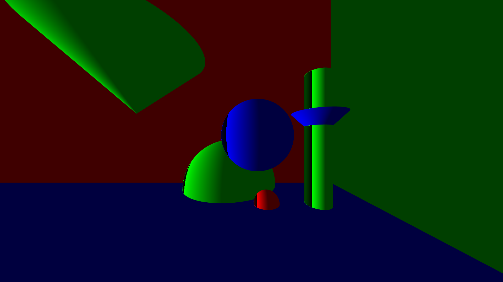

# Raytracer

<b>binary name:</b> raytracer  
<b>language:</b> C++  
<b>compilation:</b> via Makefile (`all`, `clean`, `fclean`, `re`) or CMake  

> [!CAUTION]
> - The totality of your source files, except all useless files (binary, temp files, obj files,...), must be included in your delivery.
> - All the bonus files (including a potential specific Makefile) should be in a directory named bonus.
> - Error messages have to be written on the error output, and the program should then exit with the 84 error code (0 if there is no error).

Ray tracing is a technique used to generate realistic digital images by simulating the inverse path of light.  
Your goal is to create a program able to generate an image from a file describing the scene.


> [!IMPORTANT]
> View the GitHub WIKI for more information about the project. :warning:

## Requirements

- [SFML 2.5.1](https://www.sfml-dev.org/download.php)
- [libconfig++](https://hyperrealm.github.io/libconfig/)

## Usage

### Build

```bash
∼/B-OOP-400> make
```

### Run

```bash
∼/B-OOP-400> ./raytracer --help
USAGE: ./raytracer <SCENE_FILE>
    SCENE_FILE: scene configuration
```



## Contributions

Project members:
- [Valentin P.](https://github.com/ValentinPeron)
- [Guillaume B.](https://github.com/Gaulaume)
- [Louis L.](https://github.com/LouisLanganay)[](https://wakatime.com/badge/user/3372edb3-08ff-4829-807b-29bbe42cf52b/project/018ee100-ab28-4c72-bdb5-9691a4a1faa2)
- [Augustin B.]()
